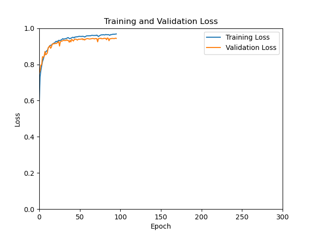
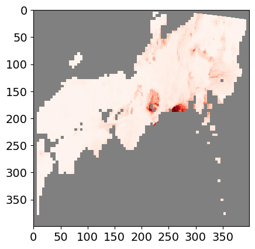
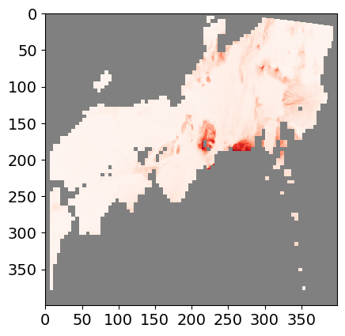
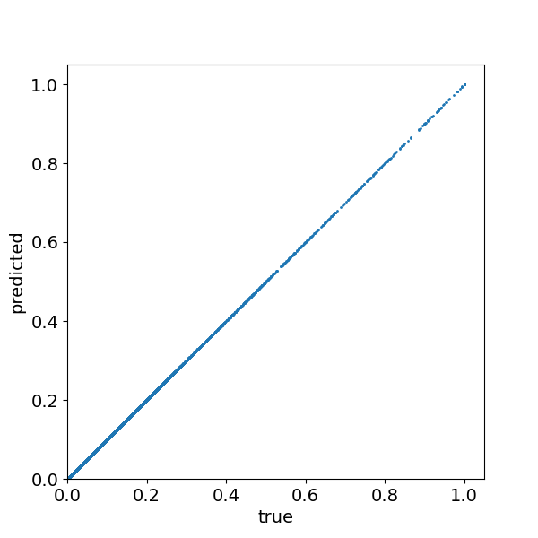

# Seismic Ground Motion Prediction using Deep Learning-based Surrogate Models

This repository provides data and codes used in the paper *Multi-MLP-Mixer based surrogate model for seismic ground-motion with spatial source and geological parameters*.

---

## Contents

* [Requirements](#requirements)
* [Installation](#installation)
* [Directory Structure](#directory-structure)
* [Usage](#usage)

  * [Training and Inference](#training-and-inference)
  * [Example Results](#example-results)
  * [Visualization](#visualization)

---

## Requirements

* Python 3.9

---

## Installation

### 1. Clone the repository

```bash
git clone git@github.com:Kurot0/seismic_surrogate_mixer.git
cd seismic_surrogate_mixer
```

### 2. Install required Python packages

```bash
pip install -r requirements.txt
```

### 3. Download the data

Download and extract all files from [google drive](https://drive.google.com/drive/folders/1H4WSzDXt68DseMZUBuZzXn6YRqCF3Ztn?usp=drive_link) and place them under the `./` folder.

The `result/` directory in the google drive contains the pretrained weights used in the experiments reported in the paper.
In particular, for the one-shot Multi-MLP-Mixer model, three variants trained with different dropout rates (0.1, 0.3, 0.5) are included.

---

## Directory Structure

The overall directory structure of this project is as follows:

```text
seismic_surrogate_mixer/
├── config.yaml                         # Experiment settings
│
├── data/                               # Data directory
│   ├── cv_data_multishot/              # Multi-shot learning datasets for cross-validation
│   ├── cv_data_oneshot/                # One-shot learning datasets for cross-validation
│   ├── sea_400.png                     # Sea area mask
│   ├── upperDepth_lonlat_400.pt        # Geological parameter data
│   ├── labels_dictionary_multishot.pkl # Label data for multi-shot dataset
│   └── labels_dictionary_oneshot.pkl   # Label data for one-shot dataset
│
├── result/                             # Trained models & result files
│   ├── exp_250916000000_multishot_mlpmixer/
│   ├── exp_250916000000_oneshot_multimlpmixer_0.1/
│   ├── exp_250916000000_oneshot_multimlpmixer_0.3/
│   └── exp_250916000000_oneshot_multimlpmixer_0.5/
│
├── misc/
│   └── visualize.py                    # Visualization script
│
└── src/                                # Core source code
    ├── crossValidation.py
    ├── evaluate.py
    ├── inference.py
    ├── ssimloss.py
    ├── train.py
    └── models/                         # Model definitions
        ├── afno.py                     # Adaptive Fourier Neural Operator [Guibas et al., ICLR 2022]
        ├── convit.py                   # Convolutional Vision Transformer [d’Ascoli et al., ICML 2021]
        ├── uno.py                      # U-shaped Neural Operator [Lehmann et al., UNCECOMP 2023]
        ├── mifno.py                    # Multiple-Input Fourier Neural Operator [Lehmann et al., JCP 2025]
        ├── mlpmixer.py                 # MLP-Mixer [Tolstikhin et al., NeurIPS 2021]
        └── multimlpmixer.py            # Proposed Multi-MLP-Mixer (extension of MLP-Mixer in this paper)
```

---

## Usage

### Training and Inference

Experiment settings such as model architecture and hyperparameters are defined in the `config.yaml` file. In particular, the dataset to be used for the experiment is specified in `data_path`, and the model to be used is specified in `model_module`.
For example, in a multi-shot learning setting with cross-validation using the proposed Multi-MLP-Mixer model, you can configure `config.yaml` as follows:

```yaml
data_path: data/cv_data_multishot
underground_data_path: data/upperDepth_lonlat_400.pt
mask_path: data/sea_400.png
result_base_dir: result

model_module: models.multimlpmixer
model_class: Network
```

To run training and inference with cross-validation:

```bash
python src/crossValidation.py
```

* Trained models and experiment results will be saved in: `result/`
* The directory name format is: `exp_{YYMMDDHHMMSS}_{SETTING}_{MODEL}` (e.g., `exp_250916000000_multishot_multimlpmixer/`).
* Inside each directory:

  * `checkpoint/` : Model weights for each fold (`cv*_model.pth`)
  * `loss_graph/` : Loss curves for each fold (`cv*_loss.png`)
  * `pred_data/` : Inference results (`cv*_pred.pt`)
  * `config.yaml` : Copy of experiment configuration
  * `result.txt` : Quantitative evaluation results

Saved weights can also be reused for inference. Example:

```bash
python src/inference.py result/exp_250916000000_multishot_multimlpmixer
```

When running `src/crossValidation.py`, the program loads experiment settings from the `config.yaml` located at the root of the repository.
When running `src/inference.py`, the program instead loads the `config.yaml` located in the specified `result/` directory, and performs inference for all folds.

---

### Example Results

* **Loss Curves (Training / Validation)**
  The following is an example from `exp_250916000000_multishot_mlpmixer/loss_graph/cv4_loss.png`.



* **Quantitative Evaluation**
  The following is an example from `exp_250916000000_multishot_mlpmixer/result.txt`.

```
Individual Results: (31.784717, 0.937626), (31.973283, 0.943903), (32.270648, 0.945620), (31.583992, 0.943013), (31.749764, 0.947818), (31.664950, 0.946627), (32.522364, 0.947405), (32.312085, 0.945339), (33.213400, 0.947383), (32.790078, 0.940169)
Combined PSNR: 32.18652820587158
Combined SSIM: 0.9444904372096061

Sv03:
  Individual Results: (30.636494, 0.923294), (30.706364, 0.928255), (31.106222, 0.930649), (30.682285, 0.933032), (30.859184, 0.936080), (30.725756, 0.935370), (31.746016, 0.935299), (31.323568, 0.931271), (32.170872, 0.933386), (31.484701, 0.923006)
  Combined PSNR: 31.144146156311034
  Combined SSIM: 0.9309643149375916

Sv05:
  Individual Results: (31.286421, 0.934916), (31.255421, 0.942220), (32.061081, 0.944678), (30.661140, 0.939027), (30.627058, 0.942774), (31.012190, 0.943326), (31.655066, 0.943736), (31.402273, 0.943426), (32.678673, 0.945170), (32.481041, 0.940300)
  Combined PSNR: 31.512036323547363
  Combined SSIM: 0.9419572591781616

Sv07:
  Individual Results: (31.868298, 0.942913), (32.264381, 0.950159), (32.111015, 0.949583), (31.620989, 0.945492), (31.891890, 0.951019), (32.030720, 0.950552), (32.684074, 0.951485), (32.480339, 0.950285), (33.588604, 0.953932), (33.036362, 0.947344)
  Combined PSNR: 32.35766716003418
  Combined SSIM: 0.949276226758957

Sv10:
  Individual Results: (33.347656, 0.949383), (33.666965, 0.954979), (33.804276, 0.957572), (33.371555, 0.954502), (33.620926, 0.961399), (32.891136, 0.957260), (34.004299, 0.959100), (34.042160, 0.956377), (34.415451, 0.957042), (34.158207, 0.950027)
  Combined PSNR: 33.73226318359375
  Combined SSIM: 0.9557639479637146

Individual Results: 49,76,62,65,85,81,71,71,66,56
Average Best Epoch: 68.2

Total Training time: 4186.97 seconds
Total Inference time: 0.8568 seconds
Avarage Inference time: 1.3644 milliseconds
```

---

### Visualization

You can also perform qualitative evaluation and visualization of the prediction results by running:

```bash
python misc/visualize.py result/exp_250916000000_multishot_multimlpmixer/pred_data/cv0_pred.pt --show_colorbar 1
```

**Arguments:**

* `pred_data_path <path>` *(positional)*: Path to the prediction tensor for a specific fold (e.g., `.../pred_data/cv0_pred.pt`).
* `--true_data_path <path>` *(optional)*: Path to the ground-truth tensor for scatter plots. If omitted, it is inferred automatically from the mode & fold in `pred_data_path`.
* `--labels_path <path>` *(optional)*: Path to the labels dictionary pickle (e.g., `data/labels_dictionary_multishot.pkl`). If omitted, it is inferred automatically.
* `--save_dir <dir>` *(optional)*: Root directory to save images. Defaults to a path inferred from `pred_data_path` and fold (creates `images_cv{FOLD}/` under the experiment directory). For example, `.../pred_data/cv0_pred.pt` → `.../images_cv0/`.
* `--mask_path <path>` *(optional, default: `data/sea_400.png`)*: Path to the sea-area mask image used to filter pixels.
* `--apply_mask <int>` *(optional, default: `0`)*: Mask application flag. `0` = apply the mask; non-zero = do not apply the mask.
* `--show_colorbar <int>` *(optional, default: `0`)*: Colorbar flag. `0` = hide; non-zero = show a colorbar in single-period images.

**Outputs:**

* **Save location**

  * If `--save_dir` is omitted, outputs are saved under `images_cv{FOLD}/` placed next to the experiment directory inferred from `pred_data_path`.

* **Directory layout** (per run):

  ```text
  images_cv{FOLD}/
  ├── true/
  │   ├── 3second/
  │   ├── 5second/
  │   ├── 7second/
  │   └── 10second/
  ├── pred/
  │   ├── 3second/
  │   ├── 5second/
  │   ├── 7second/
  │   └── 10second/
  └── concat/
  ```

* **Per-period files** (saved under `true/` or `pred/` by period):

  * Ground-motion images

    * True: `true_{SCENARIO}_{SEC}.png`
    * Pred: `{MODEL}_{SCENARIO}_{SEC}.png`
  * Scatter plots

    * True row (x=true, y=true): `true_{SCENARIO}_{SEC}_sp.png`
    * Pred row (x=true, y=pred): `{MODEL}_{SCENARIO}_{SEC}_sp.png`

* **Concatenated across all periods** (saved under `concat/`):

  * Ground-motion images: `{MODEL}_{SCENARIO}_concat.png`

    * 2-row grid: **top = Ground truth**, **bottom = Prediction**
    * Each tile has a header label: "Ground truth - {SEC} s" / "Prediction - {SEC} s"
  * Scatter plots: `{MODEL}_{SCENARIO}_concat_sp.png`

    * Same 2-row layout as above.

* **Seismic Ground Motion Images (Ground truth | Prediction)**

|                  Ground Truth                 |                    Prediction                   |
| :-------------------------------------------: | :---------------------------------------------: |
|  |  |

* **Scatter Plots (Ground truth | Prediction)**

|                  Ground Truth                 |                    Prediction                   |
| :-------------------------------------------: | :---------------------------------------------: |
|  |  |
